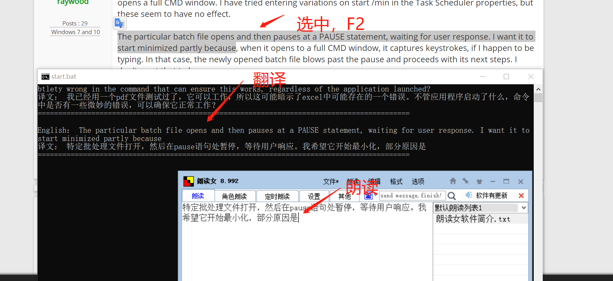

A script for Chinese to help with English reading
 
一个对中国人来说辅助英文阅读的脚本

**功能：**
选中中文，按下f1键直接朗读。
选中英文，按下f2键先翻译成中文，再进行朗读。
 
**图解：**

 
**用途：**
中文作用：
我对文字阅读不是很敏感，自己看完一句话还不是很懂，可能需要重看一遍。如果我按f1键，根据适合自己的速度同时朗读，相当于边有人念边看，效果好很多。另外，眼睛累了，可以直接用耳朵获取信息。
英文作用：
看英文文献、网页，由于非母语又英文不是很厉害，所有一直有点排斥。有了这个脚本后，选中内容，按下f2键，有人直接给你念中文，你还可以看英文原文对照。相比只看中文机翻的内容，你可以在此过程中潜移默化的学习英文，你可以看到更地道的英文表达，而不是因为有时机翻错误不懂什么意思。并且可以快速掌握英文资料内容，提高阅读英文文献的信心。
 
**原理：**
中文部分，下载“朗读女”软件，设置f1为朗读热键后，就可以达到功能。
英文部分，开始展现我骚操作的时候了，嘻嘻。原理很简单，选中英文，复制到剪切板，通过百度翻译接口转换成中文，找到软件窗体句柄，发送中文，激活朗读功能。
为什么有这种骚操作的想法呢，是因为我做毕设，老师让我去远程调用别人做好的一个软件，一点web中的按钮就自动跑出结果，然后查了下相关资料，打开了软件自动化新世界的大门。
 
**总结：**
哇，我太棒了，一个小东西这么好，我吹的也好，哈哈哈。
现在我自由时间不多，短时间不进行后续开发了。但我感觉这个东西其实不错，如果有兴趣的朋友可以整理一下，并合并成一个软件。

更多细节请参考我的博客：
https://blog.csdn.net/GreatXiang888
